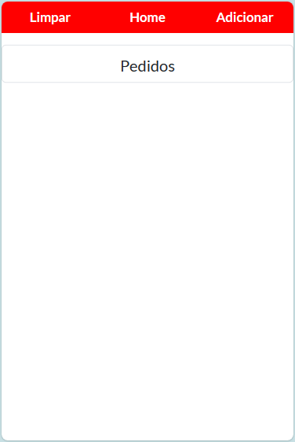
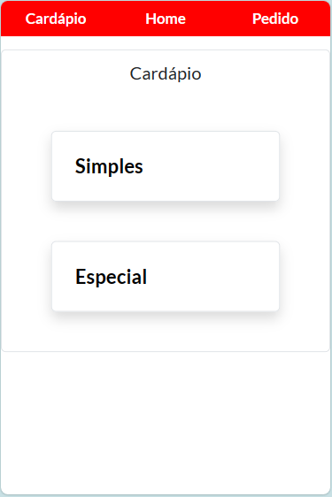
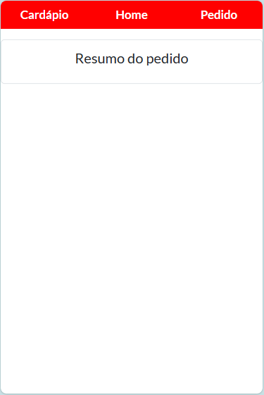
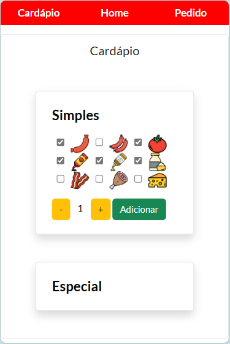
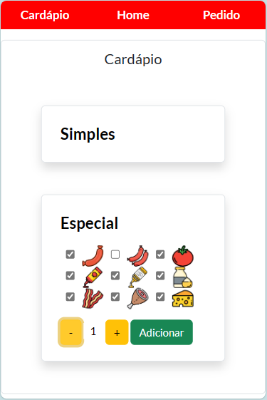
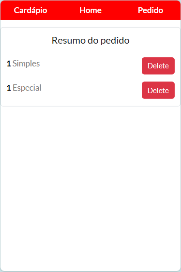
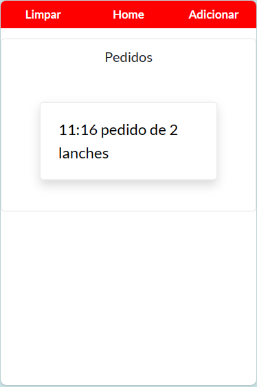
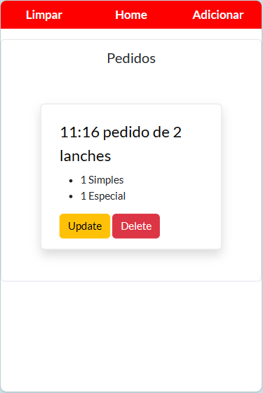

### Overview

A web application that allows you to take orders faster.
Its first version was made in two days and is specific to one establishment.

This app was built with the intention of helping me with my parent's work.
They have a very famous hot dog food truck in the city where I live. 
Almost every day at night I help them at work taking orders.
I used a notepad app to do this, but I found it time-consuming having to type in what the customer chose, what ingredients they decided to remove, and whether the order was for takeout or to eat in, etc.

So I thought to myself, why not create an app where I can do all this just by pressing buttons?
So I made this app.

### How do I take orders

It was supposed to be very simple, since we only have two types of hot dogs: the simple and the special.
However, customers often like to complicate their order.
They ask to remove the sauce, or to remove the bacon, or to make a simple one with two sausages and cheese and so on.
I write it all down.

In addition, I also note the time it was ordered, whether it is to take away or to eat and, as it is an outdoor establishment, I note whether the customer is in the car or on benches in the square.

### How this app takes orders

In the first version I wanted to do something simpler, just to write down what the customer ordered and have reliable bread control.
So, the functions this application has still don't cover all my needs, but I will improve over time.

At the moment, I can write down the hot dog chosen and which ingredients were removed or included.
Additionally, it automatically notes the order time, allowing better control of when an order is late or not.

### What I used for this project

Most of the project was developed using **Java Spring Boot**. 
I used **Thymeleaf** to dynamically build web pages and **Bootstrap** to style and make responsive.
For the database management system I used **MySQL**.
To map the objects to relational tables I used **Hibernate** with the help of **Spring Data**.

### Some scenes from the application

